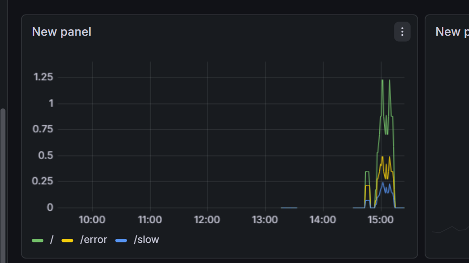

# Prometheus + Grafana Production Monitoring Stack

A production-grade monitoring stack using Prometheus, Grafana, Node Exporter, and Alertmanager — containerized with Docker Compose.

## Stack Overview

| Service | Purpose | Port |
|---|---|---|
| Prometheus | Metrics collection & storage | 9090 |
| Grafana | Visualization & dashboards | 3000 |
| Node Exporter | Linux system metrics (CPU, RAM, Disk) | 9100 |
| Alertmanager | Alert routing & notifications | 9093 |
| Web App (Flask) | Sample app exposing custom metrics | 5000 |

## Architecture

```
Sample Web App (port 5000)
       ↓ exposes /metrics
Prometheus (port 9090) ← scrapes every 15s
       ↓ stores data
Grafana (port 3000) ← visualizes dashboards
       ↓ sends alerts
Alertmanager (port 9093)
```

## Project Structure

```
production-monitoring/
├── app/
│   ├── app.py              # Flask app with Prometheus metrics
│   ├── requirements.txt    # Python dependencies
│   └── Dockerfile          # Container build instructions
├── prometheus.yml          # Prometheus scrape config
├── alert.rules.yml         # Alerting rules
├── docker-compose.yml      # All services definition
└── README.md
```

## Metrics Collected

### Application Metrics (Flask App)
- `http_requests_total` — Total HTTP requests by method, endpoint, status
- `http_request_duration_seconds` — Request latency histogram
- `active_users` — Simulated active user gauge

### System Metrics (Node Exporter)
- `node_cpu_seconds_total` — CPU usage per core and mode
- `node_memory_MemTotal_bytes` — Total RAM
- `node_memory_MemAvailable_bytes` — Available RAM
- `node_filesystem_avail_bytes` — Disk space
- `node_network_receive_bytes_total` — Network I/O

## Alert Rules

| Alert | Condition | Severity |
|---|---|---|
| HighErrorRate | Error rate > 5% for 1 min | Critical |
| HighLatency | p95 latency > 2s for 1 min | Warning |
| HighMemoryUsage | Memory > 80% for 2 mins | Warning |

## Getting Started

### Prerequisites
- Docker
- Docker Compose

### Run the stack

```bash
# Clone the repo
git clone https://github.com/Laxmi7676/Prometheus-Grafana-monitoring-project.git
cd Prometheus-Grafana-monitoring-project

# Start all services
docker-compose up -d

# Verify all containers are running
docker-compose ps
```

### Access the services

| Service | URL | Credentials |
|---|---|---|
| Prometheus | http://localhost:9090 | - |
| Grafana | http://localhost:3000 | admin / admin123 |
| Alertmanager | http://localhost:9093 | - |
| Web App | http://localhost:5000 | - |
| Node Exporter | http://localhost:9100 | - |

### Generate test traffic

```bash
# Normal requests
for i in {1..50}; do curl http://localhost:5000/; done

# Generate errors (triggers HighErrorRate alert)
for i in {1..20}; do curl http://localhost:5000/error; done

# Generate slow requests (triggers HighLatency alert)
for i in {1..10}; do curl http://localhost:5000/slow; done
```

## Grafana Dashboards

After logging into Grafana, add Prometheus as data source:
```
Connections → Data sources → Add → Prometheus
URL: http://prometheus:9090
Save & Test
```

### Key PromQL Queries

**HTTP Request Rate**
```
sum(rate(http_requests_total[5m])) by (endpoint)
```

**Error Rate %**
```
sum(rate(http_requests_total{status="500"}[5m])) / sum(rate(http_requests_total[5m])) * 100
```

**p95 Latency**
```
histogram_quantile(0.95, sum(rate(http_request_duration_seconds_bucket[5m])) by (le))
```

**CPU Usage %**
```
100 - (avg by(cpu) (rate(node_cpu_seconds_total{mode="idle"}[5m])) * 100)
```

**Memory Usage %**
```
100 * (1 - node_memory_MemAvailable_bytes / node_memory_MemTotal_bytes)
```

## Stop the stack

```bash
docker-compose down
```

## What I Learned

- Prometheus pull model — scraping `/metrics` endpoints every 15s
- PromQL queries — rate(), histogram_quantile(), aggregations
- Grafana dashboards — connecting Prometheus as data source
- Alert rules — HighErrorRate, HighLatency, HighMemoryUsage
- Node Exporter — exposing Linux system metrics
- Docker Compose — running multi-container monitoring stack
- Container networking — services talking via container names



## Tech Stack


